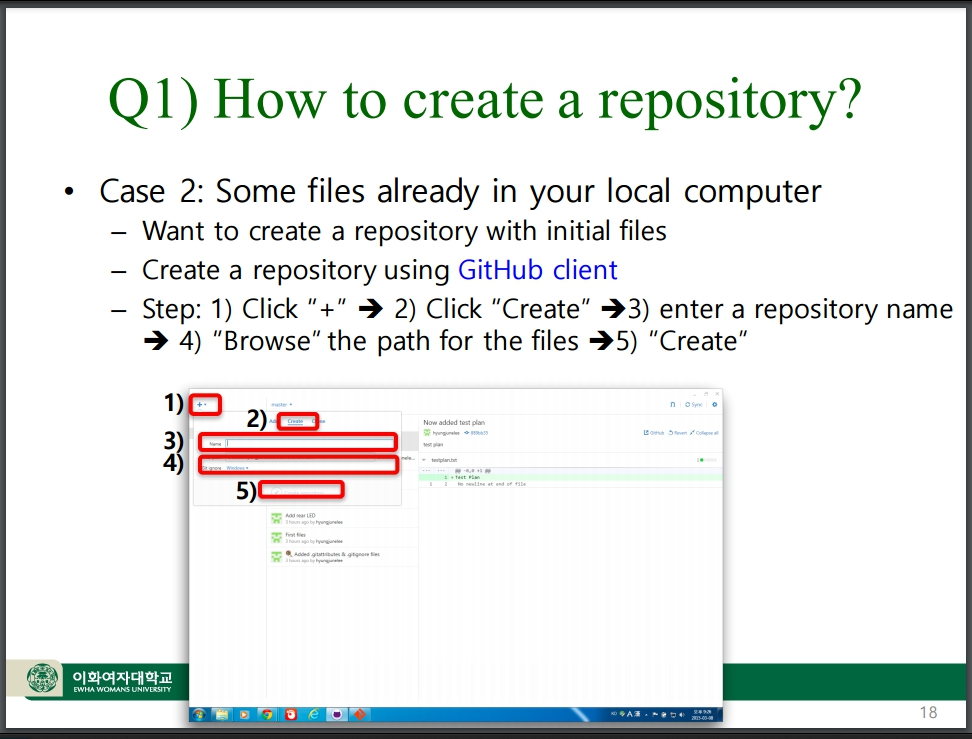

# Smart Software Project

## Homework Assignment One

# Hello GitHub World!

## By : Prof. HyungJune Lee

*hyungjune.lee@ewha.ac.kr*

# Homework Assignment One!

* **Due:** Mar 28th 2016 by 2pm. *(Monday before class starts and **Don't be late to class!**)*

* Submissions **Requirements**:
  * **Digital** file upload.
  * **Physical Hardcopy** of file, delivered to inbox *(see below for location)*.

## Homework Assignment One, part One. (1.1)

#### Online at GitHub

* Fork the repository found at https://github.com/hyungjunelee/ewha-ssp-hw1

#### Using Git commands in a Terminal:

* Clone the fork you made above onto your local computer.
  * **DO NOT USE A GUI!**
  * **Terminal command usage is REQUIRED!**
* Modify The *ewha_ssp_hw1_1.cpp* file using YOUR code from Lab Assignment #1 as needed.
  * Update lines **8** and **9** in the comment section of the file to be correct.
  * Insert your work from Lab Assignment #1 into setup() and loop().
  * If you have other functions, please include them.
* Push your changes to GitHub.
* Document each step performed with screen captures of your terminal session.
  * There are multiple steps to complete the above task, you must document each step!

#### Once you have completed the above:

* Submit the URL for the remote repository created above.
  * *HINT* - This URL will be formatted as such `https://github.com/<YOUR_GITHUB_USER_NAME>/<YOUR_GITHUB_REPO'S_NAME>[/<THERE_MAY_OR_MAY_NOT_BE_ADDITIONAL_DATA_HERE>]`
* Your grade will be largely based on the public repository you create...

## Homework Assignment One, part Two. (1.2)

**Synopsis** : Using an Androx working directory on a local computer along with the GitHub GUI you will create a repository, track changes, and push to a remote GitHub repository.

#### Using GitHub Client

* Create a repository named `ewha-ssp-hw1-2`
* Refer to Question 1, Case 2 in the Lecture slides.

* Modify the .cpp file to change it to your Lab Assignment #2-2 in Androx Studio of your local computer.
* Update the remote repository.
* Show every critical step of the proccess with screen captures of the GitHub Client.
  * There are **multiple** steps to complete the above task, you must document each step!
* Push your changes to GitHub.

#### Once you have completed the above:

* Submit the URL for the remote repository created above.
  * *HINT* - This URL will be formatted as such `https://github.com/<YOUR_GITHUB_USER_NAME>/ewha-ssp-hw1-2`
* Your grade will be largely based on the public repository you create...

Include:
* **Title Page**.
  * Student ID.
  * Your Name.
* Two repository URLs showing public locations of HW #1-1, #1-2.
* Step-by-step screen capture with brief explanation.
* What you learned from this homework.

### **Upload to Cyber Campus upload requirement**:

* PDF file of report.

### **Hardcopy Submission requirement**:

* Printout of file pdf file submmitted to Cyber Campus.
* Location for physical submission : HW box (이형준, HyungJune Lee) in front of Asan 221-1

*As stated above:*

* **Due:** Mar 28th 2016 by 2pm. *(Monday before class starts)*
